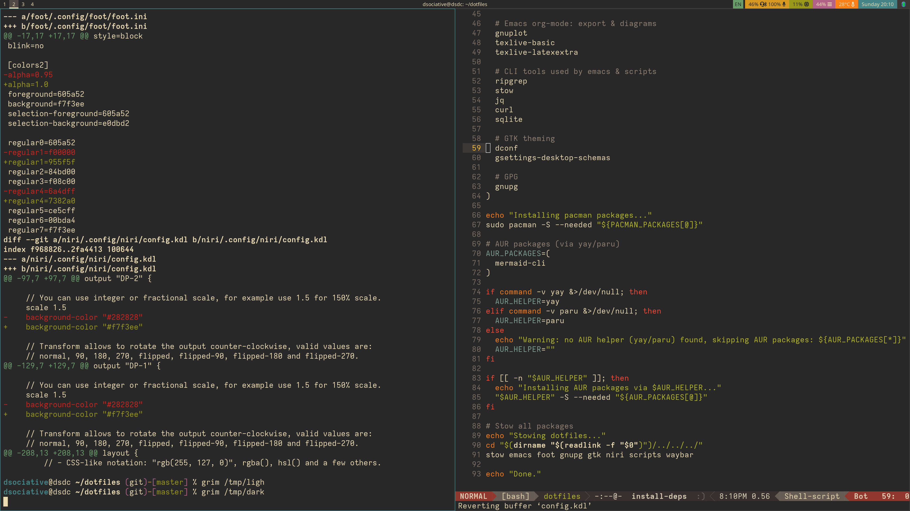
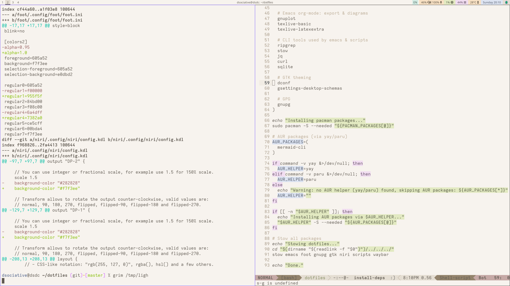

# dotfiles

Arch Linux setup managed with [GNU Stow](https://www.gnu.org/software/stow/). Niri compositor, foot terminal, Emacs, waybar.

## Screenshots

### Dark (Gruvbox)


### Light (Flatwhite)


## Install

```bash
git clone git@github.com:dsociative/dotfiles.git ~/dotfiles
cd ~/dotfiles
./scripts/.local/bin/install-deps
```

## Theme toggle

`Mod+N` switches between dark (gruvbox) and light (flatwhite) across all apps: niri, foot, emacs, waybar, GTK, mattermost.
